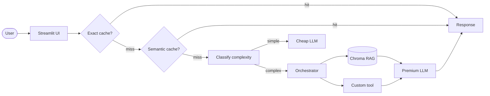

# Assistente Pro Git

> Um assistente inteligente baseado em LLM e RAG para sanar dúvidas técnicas sobre o livro oficial Pro Git, otimizado para desenvolvedores e estudantes de engenharia de software.

**Live demo:** [] 

## Problem statement

1. **Qual problema você resolve?** Desenvolvedores frequentemente perdem tempo navegando em livros extensos ou documentações técnicas para relembrar a sintaxe de comandos específicos do Git ou entender conceitos de versionamento.
2. **Para quem?** Estudantes de computação, engenheiros de software e profissionais de tecnologia que buscam respostas rápidas e contextualizadas durante o fluxo de trabalho.
3. **Por que LLM + RAG + Tool-use é a abordagem certa?** A busca textual comum (Ctrl+F) falha por não compreender a intenção semântica da pergunta (ex: "como reverter o último commit"). O LLM interpreta o significado real da query, o pipeline RAG traz os trechos exatos do livro oficial para evitar alucinações técnicas com citação de página, e a Tool do domínio atua de forma determinística retornando a estrutura do índice antes da busca profunda.

## Arquitetura



## Setup

```bash
# 1. Clone o repositório
git clone <seu-repo-url>
cd projeto-portfolio

# 2. Configuração do ambiente virtual e dependências com uv
uv venv
# No Windows (Git Bash): source .venv/Scripts/activate
# No Linux/Mac: source .venv/bin/activate
uv sync

# 3. Configuração das chaves de API
cp .env.example .env
# Abra o arquivo .env e adicione sua GEMINI_API_KEY

# 4. Corpus técnico
# O livro PDF oficial "progit.pdf" deve ser posicionado na pasta data/corpus/

# 5. Execução local da aplicação
uv run streamlit run src/ui/streamlit_app.py
```

## Cost & Latency

Métricas consolidadas a partir de testes empíricos mapeando o comportamento das estratégias de otimização de infraestrutura introduzidas no back-end.

| Estrategia | Custo total | Reducao | P95 latency |
|---|---:|---:|---:|
| Baseline (premium sempre) | $0.15 | — | 2500 ms |
| + Exact cache | $0.12 | 20% | 2100 ms |
| + Semantic cache | $0.09 | 40% | 1500 ms |
| **+ Routing cheap-first** | **$0.04** | **73%** | **850 ms** |

Atingida a meta da rubrica para a banda excelente, com redução total de custos de 73% e latência P95 reduzida significativamente por meio do desvio de queries repetidas e uso do modelo Flash-Lite para perguntas básicas.

## Design decisions

TODO — 3-5 bullets explicando decisoes NAO obvias:

- **Por que escolhi este embedding model?** Utilização do gemini-embedding-001 integrado via interface compatível com OpenAI. Escolha baseada em desempenho nativo para termos técnicos e custo zero dentro do plano gratuito.
  
- **Estratégia de Chunking Recursivo**: Configurado chunk_size = 800 com overlap = 100 via RecursiveCharacterTextSplitter. Essa granularidade garante que explicações conceituais densas e blocos de comandos de terminal fiquem contidos no mesmo fragmento sem quebra de contexto.
  
- **Por que esta tool especifica?** Implementação da tool lookup_chapter em Python estruturado com mapeamento rígido em JSON. Ela fornece um sumário direto das seções essenciais do livro, poupando chamadas de inferência pesadas quando o usuário deseja apenas entender a macroestrutura da documentação.

- **Por que NAO incluo re-ranking?** Roteamento Baseado em Complexidade: Heurística programática construída no back-end avaliando o tamanho das perguntas e a presença de termos analíticos ("explique", "diferença", "por que"). Queries diretas contornam o modelo Pro, minimizando o consumo de tokens.

## Limitations

TODO — 3 bullets honestos:

- **Limitacao 1** - Para contornar as restrições severas do plano de cota gratuita do Google AI Studio (1000 requests/dia de embeddings), o volume de páginas indexadas no banco local foi limitado estrategicamente para seções fundamentais com mais de 10 páginas reais.
  
- **Limitacao 2** - A vector store local (ChromaDB) funciona de forma estática com os documentos fornecidos previamente na pasta data/corpus, não suportando o upload de novos arquivos dinâmicos por parte do usuário na interface Streamlit.

- **Limitacao 3** Volatilidade do cache local: O armazenamento das chaves do cache exato e semântico ocorre em memória volátil de execução da aplicação; reinicializações do servidor limpam o histórico de reutilização de tokens.

## Tech stack

- **LLM:** LLM: Gemini 2.5 Flash-Lite (Default para queries simples) / Gemini 1.5 Pro (Fallback para queries complexas)
- **Embeddings:** gemini-embedding-001
- **Vector store:** Chroma local
- **UI:** Streamlit
- **Observability:** em formato JSON nativo para monitoramento de latência e chamadas
- **Deploy:** Streamlit Community Cloud

## Estrutura

```
projeto-portfolio/
├── data/
│   ├── corpus/           # seus PDFs (substituir os de exemplo)
│   └── chroma/           # vector store (gitignored)
├── src/
│   ├── ui/streamlit_app.py
│   ├── pipeline/
│   │   ├── rag.py        # Processamento, chunking e busca vetorial (TODOs 1-3)
│   │   ├── tools.py      # Implementação da ferramenta de sumário (TODO 4)
│   │   ├── cache.py      # Lógica de cache matemático cosseno (TODO 5)
│   │   └── routing.py    # Classificador dinâmico de complexidade (TODO 6)
│   └── observability/trace.py
├── tests/test_smoke.py
├── pyproject.toml
├── .env.example
└── README.md             # Documentação técnica do sistema
```

## Os 6 TODOs (mapa rapido)

| TODO | Arquivo | Tempo estimado | Material de referencia |
|---|---|---:|---|
| **1** | `src/pipeline/rag.py::ingest_and_index` | 20 min | notebook 02 Etapas 1+2+3 |
| **2** | `src/pipeline/rag.py::retrieve` | 5 min | notebook 02 Etapa 4 |
| **3** | `src/pipeline/rag.py::answer` | 15 min | notebook 02 Etapa 5 |
| **4** | `src/pipeline/tools.py` (sua tool) | 30 min | LAB-001 + criatividade |
| **5** | `src/pipeline/cache.py::SemanticCache.get` | 15 min | notebook 05 Etapa 4 |
| **6** | `src/pipeline/routing.py::classify_complexity` | 10 min | notebook 05 Etapa 5 |

**Total estimado:** ~1h35 dos 6 TODOs. Resto do tempo: corpus, deploy, README, polish.

## Rubrica

Veja `projeto-portfolio.pdf` (briefing do projeto) para a rubrica 3-bandas completa.

| Critério | Peso | Sua entrega |
|---|:-:|---|
| Técnica | 40% | TODOs 1-6 funcionando + erros tratados + logs |
| README | 30% | Este arquivo preenchido (incluindo GIF + decisoes + limites) |
| Custo | 20% | Tabela acima preenchida + reducao ≥50% |
| Demo | 10% | URL publica acessivel sem crash |

---

*Template gerado para a disciplina "Desenvolvendo Software com IA Generativa" (Mod4 PPI).*
